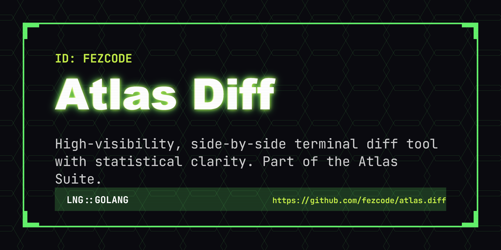

# atlas.diff



**atlas.diff** is a high-visibility, side-by-side terminal diff tool. Part of the **Atlas Suite**, it helps you compare files with a clean "Onyx & Gold" aesthetic, statistical clarity, and smooth TUI interaction.


## ✨ Features

- 🌓 **Side-by-Side Comparison:** Clear visual separation between two files.
- 🎨 **High-Visibility Styling:** Uses the signature Atlas Onyx & Gold theme for readability.
- 🏎️ **Fast Diffing:** Powered by `sergi/go-diff` for efficient and accurate comparisons.
- ⌨️ **TUI Experience:** Smooth scrolling and keyboard-centric navigation via `bubbletea`.
- 📦 **Zero Dependencies:** Compiles to a single binary for portable use.

## 🚀 Installation

### From Source
```bash
git clone https://github.com/fezcode/atlas.diff
cd atlas.diff
gobake build
```

## ⌨️ Usage

Simply run the binary with two files to compare:
```bash
./atlas.diff file1.go file2.go
```

## 🕹️ Controls

| Key | Action |
|-----|--------|
| `↑/↓` | **Scroll:** Move through the diff view. |
| `q` / `Ctrl+C` | **Quit:** Exit the application. |

## 🏗️ Building

The project uses **gobake** for orchestration. You can build for all platforms or specific targets:

```bash
# Build for all platforms
gobake build
```

## 📄 License
MIT License - see [LICENSE](LICENSE) for details.
